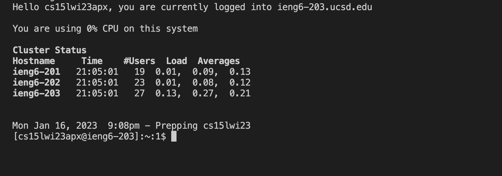
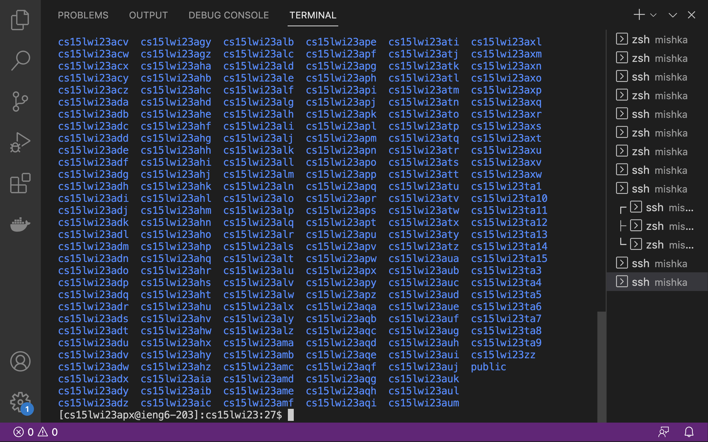

# Installing VS Code 
Go to a browser of your choice and enter the following site :https://code.visualstudio.com/, click on the blue space that says “Download” at the top most right corner of your screen. 

Select the the type of system that you plan on using and continue with the steps to install VS code.

After installation, Open VS Code. You will see the following screen below:

# Remotely Connecting
Go to the toolbar and select “New Terminal” under the drop down menu for “Terminal”. 

Now, type the following into the terminal **cs15lwi23zz@ieng6.ucsd.edu**. Make sure to change the "zz" to  the letters in your course-specific account.
If this is the first time you have connected to the server, you will receive the following message, type yes to continue. 
*⤇ ssh cs15lwi23zz@ieng6.ucsd.edu
The authenticity of host 'ieng6-202.ucsd.edu (128.54.70.227)' can't be established.
RSA key fingerprint is SHA256:ksruYwhnYH+sySHnHAtLUHngrPEyZTDl/1x99wUQcec.
Are you sure you want to continue connecting (yes/no/[fingerprint])? 
Password: *

After doing so, you will be asked to Enter the password. 
You will see the following on the terminal. 

# Trying Some Commands
Now, you can go ahead and try some commands on your own such as-
**cd ~
cd
ls -lat
ls -a
ls <directory> where <directory> is /home/linux/ieng6/cs15lwi23/cs15lwi23abc, where the abc is one of the other group members’ username
cp /home/linux/ieng6/cs15lwi23/public/hello.txt ~/
cat /home/linux/ieng6/cs15lwi23/public/hello.txt** 
  
Here is a sample: 
  
  
  

