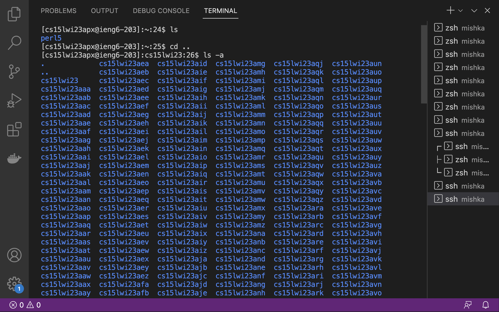

# Installing VS Code 
Open a browser of your choice, such as safari or google chrome and go to the following site :https://code.visualstudio.com/. Click on the blue space that says “Download” at the top most right corner of your screen.

You will be directed to the follwing page, select the type of system that you plan on using, and continue by downloading the zip file for VS code. Then, open the file in your laptop and complete the required installation steps for the app by extracting the file.

After installation, Open VS Code. You will see the following screen below:

# Remotely Connecting
Go to the toolbar at the top and select “New Terminal” under the drop down menu for “Terminal”. 

Now, type the following into the terminal **cs15lwi23zz@ieng6.ucsd.edu**.  
NOTE : Make sure to change the "zz" to  the letters in your course-specific account. For example, mine is apx.  
If this is the first time you have connected to the server, you will receive the following message, type yes to continue. 
*⤇ ssh cs15lwi23zz@ieng6.ucsd.edu  
The authenticity of host 'ieng6-202.ucsd.edu (128.54.70.227)' can't be established.
RSA key fingerprint is SHA256:ksruYwhnYH+sySHnHAtLUHngrPEyZTDl/1x99wUQcec.
Are you sure you want to continue connecting (yes/no/[fingerprint])? 
Password: 

After doing so, you will be asked to Enter the password.  
Note that while entering the password, the characters of the password will not be shown.

# Trying Some Commands
Now, you can go ahead and try some commands on your own such as:-  

**cd: change directory** : Used to switch the current working directory. 
**ls list**  : List used to list the files and folders of the given path. 
**pwd print working directory** : Used to display the current working directory. 
**cat** : Prints the contents of one or more files given by the paths. 
**mkdir**: Makes a new directory. 

You can open ypur terminal, and try different combination of theese commands to see what happens. 

Here are a few samples:  

I tried a combination of the commands ls and cd. 
As you can see, cd is used to change the directories that you are in and ls is used to list all the files in that particular directory.  
I have also used pwd in the same to show working directory. 
 After that I used cd to change the working directory to "/", and used ls to show the list of files and folders in that directory. 
The same thing is repeated by changing the directory to "home/linux/ieng6" and then using ls to show the files in that folder.

Here is another sample, As done above first we cd and then ls to list the files, but this time using ls-lat, this lists the files in a different and long formnat which is sorted on the basis of time. After that using mkdir to create a new directpry named "abc". 

Here is another fun thing to try, through this you can list everyones accoount.  
cd.. is used to navigate up a directory level and then use ls -a. 

  

